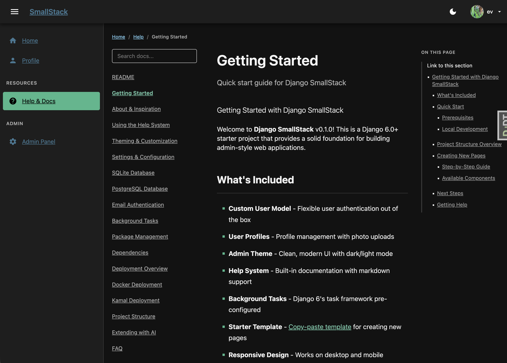
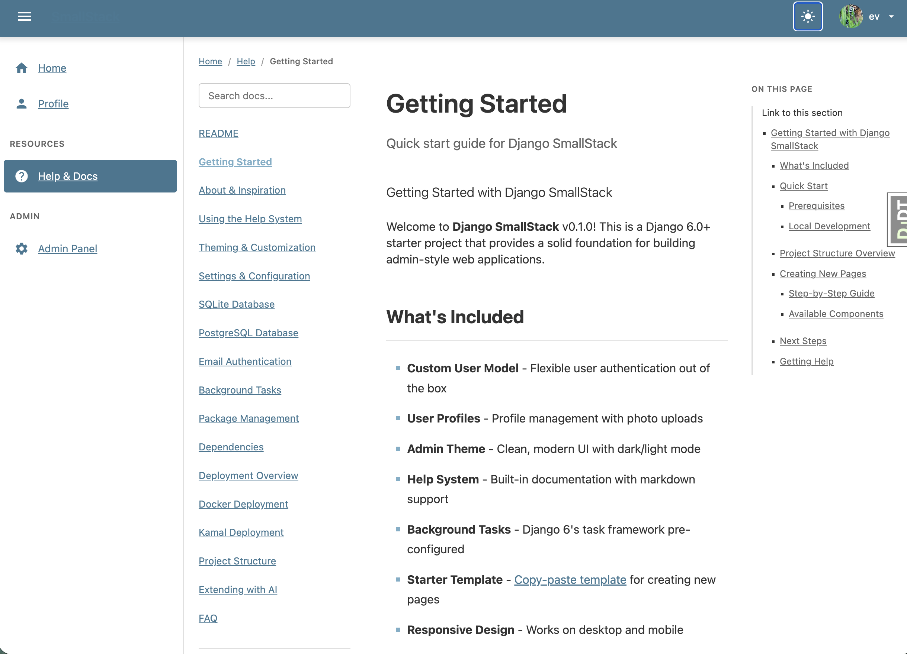

# Django SmallStack

*Django that doesn't get in your way. Focus on your idea, not the stack.*


**One small backend. Many roles.** A small-footprint Django foundation that drops into your stack and plays whatever role you need — often several at once. From a single model definition, SmallStack is an **admin app**, a **REST backend** for your React/Svelte/Solid frontend, an **MCP server** for AI agents, a fast **search engine**, an **integration hub** (webhooks, feeds, OpenAPI), and a **task runner**.

SQLite by default (scales further than you'd think), no external services required — everything runs on a single machine or container.

📖 **Full docs, guides & the full story → [www.smallstack.site](https://www.smallstack.site/)**

---

## Five surfaces from one declaration

The mechanism behind the roles: a `CRUDView` bound to a model derives CRUD tools automatically, then exposes them on the surfaces you opt into. One model. One view. Five independent outputs.

```python
# apps/tickets/views.py
class TicketCRUDView(CRUDView):
    model = Ticket
    list_columns = ["id", "title", "status"]
    enable_api = True      # → REST + OpenAPI
    enable_mcp = True      # → Claude tools
    enable_search = True   # → full-text search
```

This generates:

**→ HTML** (`/tickets/`)
CRUD pages with htmx tabs, filters, sorting, pagination. Dark/light themes (5 color palettes).

**→ REST API** (`/api/tickets/`)
REST endpoints with bearer-token auth, OpenAPI 3.0 spec, automatic pagination and filtering.

**→ MCP Server** (`/mcp`)
JSON-RPC tools `tickets_list`, `tickets_get`, `tickets_create`, etc. — ready for Claude Desktop and agent frameworks.

**→ Search Interface** (`/search/`)
Full-text search page + `search_tickets` MCP tool for retrieval (RAG pipelines).

**→ CLI** (`sc tickets`)
Terminal CRUD: `sc ls`, `sc get`, `sc search`, staff-gated `sc new/set/rm`. `--json` on everything.

Same form validation, same permission logic, all five surfaces. You change the model once; all five update automatically. No "keep the API in sync with the UI" drudgery.

---

## Many roles, one backend

SmallStack isn't one kind of app — it's a small backend that plays whatever role your architecture needs, usually several at once:

| Role | What it means |
|------|---------------|
| **Admin app** | Auth, profiles, five-palette light/dark, tables, modal editors, filters, breadcrumbs — the internal tool you'd build anyway. |
| **Headless API backend** | REST with token auth and OpenAPI 3.0, plus bundled typed clients for React, Svelte, Solid & Streamlit (`clients/`). Point your SPA at it. |
| **MCP server** | OAuth + JSON-RPC tools derived from your models — Claude Desktop and the Connectors UI work with no setup. |
| **Search engine** | Real full-text search — FTS5/BM25 on SQLite, `tsvector` + GIN on Postgres — ranked, with a Ctrl-K omnibar, an MCP tool, and custom variants (SearchBuilder). |
| **Integration hub** | Signed webhooks (inbound + outbound), RSS/Atom publish + consume, and Swagger + ReDoc for every endpoint. The seam between your systems. |
| **Task runner** | One-shot jobs plus recurring `@scheduled` work (cron/interval/once) on a DB-backed worker — no Redis or Celery to operate. |

*Not ideal for:* microservices (SmallStack is monolithic by design) or very high-traffic platforms (single-machine focused, >1000 req/s).

---

## What you get

**The things you don't have to build:**

- **Web CRUD UI** — HTML pages with htmx interactions, filters, sorting, pagination, dark/light themes (5 color palettes)
- **REST API + live docs** — Bearer-token auth, OpenAPI 3.0 with Swagger UI (`/api/docs/`) and ReDoc (`/api/redoc/`), automatic pagination, filtering
- **Bundled API clients** — Typed TypeScript/JS SDK and a single-file Python client, always the same version as your API (`clients/`)
- **MCP server** — JSON-RPC + OAuth + PKCE, works with Claude Desktop and agent frameworks
- **Full-text search** — SQLite FTS5 or Postgres SearchVector, with custom ranking and variants (SearchBuilder)
- **Webhooks** — Signed outbound delivery on model change + verified inbound receivers, with four seams for Zapier/n8n/Stripe/Slack
- **RSS / Atom feeds** — Publish any model as a feed with one flag, or consume external feeds on a schedule
- **Background tasks & scheduler** — DB-backed queue (no Redis/Celery to operate) plus a `@scheduled` recurring-job scheduler with a themed UI, REST + MCP surfaces, and cron/interval/once cadences
- **Activity & audit logs** — Request logging with auto-pruning and breakdown stats
- **Auth** — Custom User model, photo, timezone, theme preference, token management
- **Health monitoring** — Uptime monitoring, status page, API/MCP health dashboards
- **Docs & help system** — Bundled markdown docs with images, versioning, and search

All of these run themselves. You don't configure them; they're just there.

---

## For AI-assisted development

SmallStack is built around the vibe-coding workflow. When you open Claude Code or Cursor:

**`CLAUDE.md`** — Orients the AI to your codebase and lists the essential skills per task type. The AI knows where to look and what patterns to follow.

**`docs/skills/`** — A library of reference guides covering the full stack:
- Modern dark theme (how to build pages that work across all 5 palettes on the first try)
- CRUDView patterns and configuration
- SearchBuilder (custom variants, computed fields, ranking)
- MCP tool authoring
- Webhooks & feeds (integration seams)
- API conventions and client generation
- CLI patterns
- Deployment playbooks

The depth is real — 40+ skill files covering everything from "add a new model" to "deploy to production" — but they're organized so the AI finds the right one for the task at hand.

**Result:** You spend your mental energy on your app's logic, not wrestling with framework conventions or cargo-culting from Stack Overflow.

---

## Quick start

**Prerequisites:** [uv](https://docs.astral.sh/uv/) (manages Python automatically, no system Python needed) and `make`.

```bash
# Install uv if you don't have it:
curl -LsSf https://astral.sh/uv/install.sh | sh   # macOS / Linux
# Windows: powershell -ExecutionPolicy ByPass -c "irm https://astral.sh/uv/install.ps1 | iex"

# Clone and bootstrap:
git clone https://github.com/emichaud/django-smallstack.git myapp
cd myapp
make setup    # uv sync + migrate + create dev superuser (admin/admin)
make run      # dev server on port 8005
```

Open http://localhost:8005, log in with `admin` / `admin`. The `/help/` section has the rest.

**Docker:** `cp .env.example .env && docker compose up -d` (port 8010).

---

## Modern dark theme

Five color palettes × two themes (light/dark) — switchable from the user menu. The default near-black aesthetic with vibrant Tailwind-style accents works in any light. Build pages that look correct across all 5 automatically.

<p>
  
  
</p>

---

## Development

```bash
make test          # pytest with coverage
make lint          # ruff check
make lint-fix      # ruff check --fix
make api-test      # REST API smoke test
make mcp-test      # MCP server smoke test
```

---

## Learn more

**[www.smallstack.site](https://www.smallstack.site/)** tells the full story — the many roles, setup guides, palette details, CRUDView patterns, SearchBuilder examples, webhooks & feeds, MCP setup, and deployment recipes.

Your local `/help/` section (available once running) mirrors the essentials.

---

## License

MIT — use it, modify it, ship it.
