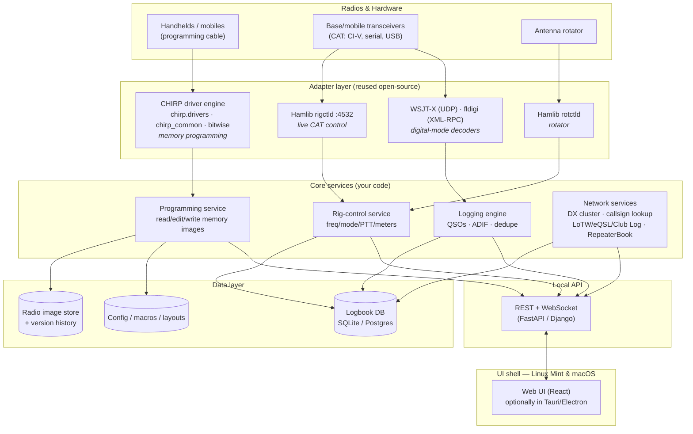

# Modern Ham Station Manager — Building on CHIRP, borrowing from Ham Radio Deluxe

*A platform comparison, architecture, and build plan for a polished cross-platform (Linux Mint / macOS) programming + operating application.*

---

## 1. The key reframing (read this first)

The instinct is to treat CHIRP and Ham Radio Deluxe (HRD) as two competing tools to merge. They aren't. They solve **two mostly-different problems** that happen to share one thing — talking to a radio over a serial/USB link.

- **CHIRP is a *programming* tool.** Its job is to read a radio's channel memory, let you edit channels/tones/settings in a spreadsheet-style grid, and write the memory back. Its superpower is *breadth*: ~350 drivers covering 1,000+ models from 100+ manufacturers, all reduced to one common data model. It is **not** a live operating tool — it doesn't do CAT rig control for operating, has no logbook, no digital modes, no DX cluster.
- **HRD is an *operating* suite.** Its five modules — Rig Control, Logbook, DM-780 (digital modes), Satellite Tracking, Rotator Control — are about running a station *live*: controlling the rig over CAT, logging QSOs, decoding PSK/RTTY/CW, uploading to LoTW/eQSL. It is **not** a bulk channel-programming tool; nobody uses HRD to program a Baofeng handheld.

So the overlap is thin (both open a serial port), and the "merge" is really: **take CHIRP's programming engine and wrap a modern, HRD-style operating + logging layer around it**, in one cross-platform app. That product doesn't exist today — CHIRP is programming-only, and HRD is Windows-only and closed-source. That gap is your opportunity.

This reframing matters because it means you **reuse CHIRP as a library** (its driver engine is cleanly separated from its GUI) rather than forking and fighting its wxPython UI, and you **build the operating side on proven open-source rig-control infrastructure (Hamlib)** rather than reinventing CAT control for hundreds of radios.

---

## 2. What each tool actually is

### CHIRP (CHIRP-next)
- **License:** GPL (v3). Created by Dan Smith (KK7DS), actively developed since 2008.
- **Current build:** CHIRP-next — a full rewrite in **Python 3 with a wxPython GUI**, replacing the old Python 2 / PyGTK stack. This is the only actively-maintained version.
- **Architecture (the important part):** strict model/view separation. Each radio is a **driver** that implements a standard model the UI expects:
  - `get_features()` returns a `chirp_common.RadioFeatures()` object describing what the radio supports (valid modes, tuning steps, power levels, memory bounds, tone modes, etc.).
  - `process_mmap()` parses the raw memory image using **`chirp.bitwise`** — a declarative memory-map DSL where you describe the radio's byte/bit layout as a struct string and CHIRP handles the packing/unpacking.
  - Drivers register themselves via a `@directory.register` decorator.
  - Two driver styles: **clone-mode** (download/upload the whole memory image — most handhelds) and **live-mode** (per-channel reads/writes — e.g. some Kenwood mobiles).
  - Their own docs are explicit: *"the driver is supposed to implement the model and the GUI implements the view… CHIRP is an abstraction by definition, not a framework for making custom bespoke programming software."* The GUI has already been rewritten once. **This is exactly the seam you build on** — the driver layer is designed to be driven independently of the GUI.
- **Nice-to-haves it already has:** RepeaterBook integration (pull repeater data by location directly into a memory file), CSV/image import-export, cross-platform (Windows/macOS/Linux).

### Ham Radio Deluxe (HRD)
- **License:** commercial/closed-source, Windows-only. Current line is v6.x.
- **Five integrated modules:**
  - **Rig Control** — full-screen CAT control of the transceiver; also exposes control to the other modules and over **TCP/IP for remote operation**.
  - **Logbook** — QSO logging, **DX cluster** connectivity, **callsign lookup**, **awards tracking with LoTW / eQSL / HRDLog.net**, contesting, ADIF import/export, backup/recovery (Access or MySQL backend).
  - **DM-780 (Digital Master)** — sound-card digital modes (PSK31, RTTY, CW, SSTV, MT-63, etc.), SuperSweeper (decode up to ~40 signals across the passband), auto-logging into the Logbook, WinKeyer/FSK support.
  - **Satellite Tracking** — with rig control + map/Google Earth integration.
  - **Rotator Control** — ~15 antenna-rotator models.
- **What operators love** (and what's missing from CHIRP): live rig control, deeply integrated logging + awards, DX cluster, callsign lookup, digital-mode integration, and a polished (if busy) all-in-one interface.
- **What operators complain about:** Windows-only, occasional instability/lost macros and layouts, a cluttered UI, and it's paid/closed.

---

## 3. Feature comparison

| Capability | CHIRP (next) | Ham Radio Deluxe | **Proposed Station Manager** |
|---|---|---|---|
| **Channel memory programming** | ✅ Core strength (1,000+ models) | ❌ Not a purpose | ✅ Reuse CHIRP engine |
| **Radio breadth** | ✅ ~350 drivers | ⚠️ ~100 rigs (CAT only) | ✅ Inherit CHIRP + Hamlib |
| **Live CAT rig control** | ❌ | ✅ | ✅ Via Hamlib/rigctld |
| **Logbook** | ❌ | ✅ Full | ✅ First-class ("amazing logging") |
| **ADIF import/export** | ⚠️ (CSV, images) | ✅ | ✅ |
| **DX cluster** | ❌ | ✅ | ✅ (Telnet cluster client) |
| **Callsign lookup (QRZ/HamQTH)** | ❌ | ✅ | ✅ |
| **Awards: LoTW / eQSL / Club Log** | ❌ | ✅ | ✅ |
| **Digital modes (PSK/RTTY/FT8)** | ❌ | ✅ (DM-780, built-in) | ✅ *Orchestrate* WSJT-X/fldigi |
| **Satellite tracking** | ❌ | ✅ | 🔷 Phase 3 (via Gpredict/SGP4) |
| **Rotator control** | ❌ | ✅ | 🔷 Phase 3 (Hamlib rotctld) |
| **RepeaterBook import** | ✅ | ❌ | ✅ Keep + extend |
| **Remote / networked control** | ❌ | ✅ (TCP/IP) | ✅ Native (local web architecture) |
| **Config versioning / backup** | ⚠️ Manual .img files | ⚠️ DB backup | ✅ First-class (git-like image history) |
| **Linux support** | ✅ | ❌ | ✅ Primary target (Linux Mint) |
| **macOS support** | ✅ (native) | ❌ | ✅ Primary target |
| **License** | GPL (open) | Commercial (closed) | GPL (see §7) |
| **UI polish** | ⚠️ Functional/raw | ⚠️ Rich but cluttered/dated | 🎯 The differentiator |

Legend: ✅ strong · ⚠️ partial/weak · ❌ absent · 🔷 planned later · 🎯 primary goal

**Takeaway:** the merged product is *CHIRP's programming breadth + HRD's operating suite + a modern cross-platform UI*, with logging and config-versioning elevated to headline features — landing in a space neither incumbent occupies.

---

## 4. Architecture

### 4.1 Approach

Four principles:

1. **Reuse, don't fork.** Import CHIRP as a Python library (`chirp.drivers`, `chirp.chirp_common`, `chirp.bitwise`, `chirp.directory`). Drive the programming engine headless behind your own service. You get 350 drivers "for free" and inherit new ones as upstream adds them — provided you track upstream and stay GPL-compliant (§7).
2. **Stand on Hamlib for live control.** Don't rebuild CAT control. **Hamlib** (LGPL, actively maintained — v4.6.x) is the invisible backbone of Linux ham software; fldigi, WSJT-X, CQRLog, Gpredict all use it. Run its **`rigctld`** daemon (TCP :4532) so multiple parts of your app share one radio without serial-port contention. (FLRig/XML-RPC :12345 is an alternative if you hit a rig only it supports.)
3. **Orchestrate the digital modes, don't reimplement them.** DM-780 is a huge surface. Instead, integrate the tools operators already run: consume **WSJT-X's UDP broadcast** and **fldigi's XML-RPC** to auto-log FT8/PSK/RTTY QSOs. You get best-in-class decoders without owning DSP.
4. **Local-service + web-UI shell for true cross-platform.** A local Python backend exposes REST/WebSocket; the UI is a browser app (optionally wrapped in a desktop shell). One codebase runs identically on Linux Mint and macOS — this sidesteps the native-GUI toolkit pain that made HRD Windows-only and CHIRP's wx UI feel dated.

### 4.2 Diagram

### 4.3 Why this shape

- The **adapter layer** is entirely reused, battle-tested open source — the highest-risk parts (serial protocols for hundreds of radios, CAT quirks, DSP) are things you *don't* write.
- The **core services** are the thin, valuable glue that's genuinely yours: unifying programming + operating + logging behind one API.
- The **local-API + web-UI** split is what gives you painless cross-platform *and* frees you to make the "polished" UI that's the whole point — and it makes networked/remote operation (an HRD selling point) fall out naturally, since the UI already talks to the backend over HTTP/WS.

---

## 5. Toolset recommendations

Chosen to match a Python-first, Django-comfortable workflow and Linux/macOS targets:

- **Language / runtime:** Python 3.11+ (matches CHIRP; keeps the driver engine in-process). Package with **uv**.
- **Reused engines:** `chirp` (GPL, as a library) · **Hamlib** `rigctld`/`rotctld` (LGPL) · optionally **FLRig** as a fallback CAT backend.
- **Backend/API:** **FastAPI** for a lightweight local service + WebSocket for live rig telemetry/PTT/spots. (Django + Channels is viable and closer to your default stack; FastAPI is lighter for a desktop-local daemon — either works, pick on team familiarity vs. footprint.)
- **Database:** **SQLite** as the default single-operator store (zero-config, file-based, easy backup); **Postgres** as an optional upgrade for multi-op/club or heavier logging. ADIF is the interchange format for LoTW/eQSL/contest tools.
- **Digital-mode integration:** WSJT-X **UDP** listener + **pyfldigi** (fldigi XML-RPC). No DSP to own.
- **Serial:** `pyserial` for anything not already handled by CHIRP/Hamlib.
- **UI:** **React** front-end (your existing comfort zone). For distribution as a "real app," wrap in **Tauri** (small, Rust shell, good macOS + Linux support) or Electron if you prefer JS-only tooling. Browser-only mode is a zero-install fallback.
- **Packaging/distribution:** Linux — Flatpak/AppImage/`.deb` for Mint; macOS — signed/notarized `.app` (note CHIRP's own macOS builds are unsigned, which is a friction point you can beat). **Docker/Kamal** fits a "club server" deployment where the backend runs on a shared box and operators hit the web UI.
- **Dev tooling:** Claude Code + a `CLAUDE.md` capturing the CHIRP driver conventions and the Hamlib model map; an MCP server later if you want the assistant to query the logbook.

---

## 6. Build plan (phased)

**Phase 0 — Spike & license decision (1–2 wks).** Import `chirp` headless, enumerate drivers, do a round-trip: read a real radio's memory → parse via `bitwise` → edit a channel → write back. Stand up `rigctld` and read frequency/mode from a CAT rig over TCP. Confirm the GPL implications (§7) before writing much. *Exit: proof both engines drive cleanly from your own process.*

**Phase 1 — Programming MVP (3–5 wks).** Wrap the CHIRP engine behind the REST API; build the spreadsheet-style channel editor in React with RepeaterBook import and image save/load. Add **config version history** (every read/write snapshots an image — an immediate improvement over loose `.img` files). *This alone is a nicer CHIRP on Mint/macOS.*

**Phase 2 — Operating + logging core (4–6 wks).** Rig-control service over Hamlib (freq/mode/PTT/meters, live via WebSocket). Logging engine: QSO entry, ADIF in/out, dedupe, callsign lookup (QRZ/HamQTH), DX-cluster Telnet client, LoTW/eQSL/Club Log upload. *This is where you cross into HRD territory — and where "amazing logging" becomes the headline.*

**Phase 3 — Digital + extras (ongoing).** WSJT-X/fldigi auto-logging; then satellite tracking (SGP4/Gpredict) and rotator control (rotctld) as the two remaining HRD modules. Remote/multi-op mode (already mostly free from the architecture).

**Cross-cutting from day one:** clean adapter interfaces (so a driver/CAT backend can be swapped), automated round-trip tests against saved radio images (never brick a user's radio), and a genuinely uncluttered UI — the thing HRD users most wish they had.

---

## 7. The one risk to decide early: licensing

**CHIRP is GPL (v3).** If you import CHIRP's modules, your application is almost certainly a **derivative work** and must itself be **GPL-licensed and distributed with source**. That's fine for an open-source project — and arguably the right, community-friendly move here — but it forecloses a closed-source commercial product built directly on CHIRP's code.

Options, in rough order of least-to-most effort:
1. **Embrace GPL** — ship open source. Simplest, community-aligned, and CHIRP's breadth is yours.
2. **Process isolation** — run CHIRP as a *separate GPL process/CLI* you call over IPC, keeping your UI/services in a separate (non-GPL) codebase. This is legally greyer than people assume; get real advice before relying on it for commercialization.
3. **Own driver layer** — reimplement the programming engine from scratch (clean-room), losing CHIRP's 350 drivers. Rarely worth it.

Hamlib is **LGPL**, which is more permissive (dynamic linking / running `rigctld` as a separate process is unproblematic), so the operating side doesn't carry the same constraint. **Decide the CHIRP question in Phase 0** — it shapes everything downstream.

---

## 8. One-paragraph summary

Don't merge two tools — build the tool neither one is. Reuse CHIRP's driver engine (headless, as a library) for programming breadth, stand up Hamlib's `rigctld` for live rig control, orchestrate WSJT-X/fldigi for digital modes, and put a first-class logging core and a genuinely clean React UI on top, all served by a local Python API so it runs the same on Linux Mint and macOS. Elevate logging and config-versioning to headline features, and settle the GPL question before you write much code.
